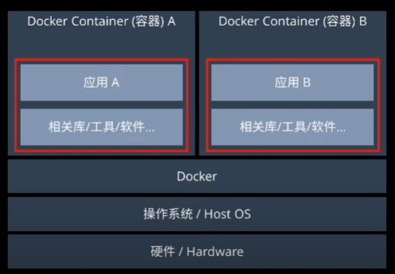
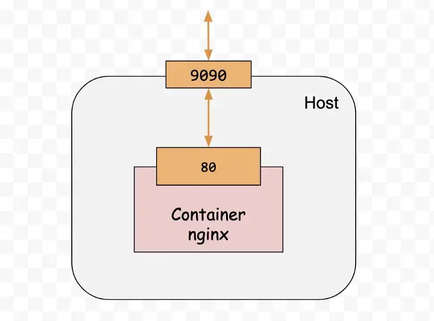

Dokcer
===
🔙 [MENU README](./README.md)


> docker逃逸 bluskyson
> https://hackmd.io/@blueskyson/docker-security
> docker desktop 

# Introduction
1. CaaS : Containers as a Service 
2. Implemented in the Golang developed by Google
3. Frequently, when installing specific services, problems occur due to disparities in <font color=red>OS versions, kernel differences, absent or wrongly set environment variables, or misconfigured settings.</font> 
4. These issues cause services to malfunction, resulting in a substantial amount of time spent on trial and error, subsequently affecting work efficiency.
5. Container: Application-centric virtualization


---

# The three Important components of Docker
1. Image
   - like Virtual machine snapshots.
   - Can be used to create containers.
   - Can be pulled from Docker Hub.
   - Can be exported from another computer's Docker image and then imported to your own computer.
   - Requires writing a **Dockerfile**.
2. Container
   - A Docker container is a process that is run using a Docker image, and m**ultiple Docker containers can be launched from the same Docker image**.
    
   - Docker utilizes containers to execute applications.
   - Containers can be started, stopped, and deleted as needed.
   - Each container is **isolated** from others, providing a secure platform.
3. Repository
   - https://hub.docker.com/
   - A repository is a centralized location for storing image files.
   - Each repository contains multiple image files.
   - Each image file has different tags.
   - Repositories come in two forms: public and private.


---

# Install & Uninstall
Install
```bash
# install
sudo apt install -y docker
sudo apt-get install docker.io

systemctl start docker
systemctl enable docker

service docker status

sudo usermod -aG docker $username  # restart

docker version
# result should have
# Client:
# Server:
```
Uninstall
```bash
# uninstall
rpm -qa|grep docker
sudo remove docker-client
sudo remove docker-common
cd /etc
rm –rf docker
cd /var/lib
rm –rf docker
```
Docker Desktop
```bash
https://www.docker.com/products/docker-desktop/
```

---

# Image
DockerHub
```bash
docker search centos
# NAME：映像檔名稱
# DESCRIPTION：映像檔描述
# STARS：越多代表越多人使用
# OFFICIAL：官方Image
# AUTOMATED：自動化
docker pull ubuntu


# list
docker image ls
docker images
# REPOSITORY：倉庫位置和映像檔名稱
# TAG：映像檔標籤(通常是定義版本號)
# IMAGE ID：映像檔ID(唯一碼)
# CREATED：創建日期
# SIZE：映像檔大小


# remove
docker image rm $IMAGE_ID_OR_NAME
```
Commit
```bash
docker container commit $CONTAINER_ID [Repository:[Tag]]
```
docker image import / export
```bash
```


# Dockerfile
1. 基底映像檔資訊
2. 維護者資訊
3. 映像檔操作指令
4. 容器啟動時執行指令

Dockerfile
```bash

```
build
```bash
# Change to the directory where the Dockerfile is located.
docker build -t $IMAGE_NAME:$TAG . --no-cache

docker images # to see result
```

---


# Volume
volume
```bash
# volume
docker volume ls  # /var/lib/docker/volumes
                  # ~/AppData/Local/Docker/wsl

docker inspect $VOLUME_NAME

docker volume prune

docker volume rm $VOLUME_NAME
```
```bash
# named volume
docker volume create --name db-data
# /var/lib/docker/volumes/db-data/_data


# host volume 
# 指定本機的 ~/app 跟容器內的 /app 連通
docker run -v ~/app:/app --workdir /app node:slim npm init -y # local will create a package.json

```
---

# Network
```bash
# Network  Driver
# bridge   bridge (Default)
# host     host
# none     null
```

```bash
# Container IP
docker container inspect -f '{{range.NetworkSettings.Networks}}{{.IPAddress}}{{end}}' $IMAGE_ID_OR_NAME


docker network ls

# list Container IP
docker network inspect bridge

```

# Container
```bash
-i  ：interactive則讓容器的標準輸入保持打開
-t  ：讓Docker分配一個虛擬終端(TTY)並綁定到容器的標準輸入上
-d  ：背景執行
-e  ：設定環境變數(AAA=BBB)
-p  ：Port Map   ($host_port:$container_port)
-v  ：volume Map ($host_folder:$container_folder)
–net :指定要將 container 掛在哪一個自定義的網路底下
--name :設定容器名稱
```
Run Container
```bash
# container
docker ps #-a for all
docker container ls #-a for all
# CONTAINER ID
# IMAGE
# COMMAND
# CREATED
# STATUS
# PORTS
# NAMES 名稱是Docker隨機取的，可以用這個NAMES進行指令操作


# Run
docker run -ti centos
docker run -d ubuntu:14.04 /bin/sh -c "while true; do echo hello world; sleep 1; done"

# Run with Volume
docker run -d 
docker container run --name websrv1 -d -p 9090:80 $image

# Remote Shell
docker run -ti centos /bin/bashn #run with remote shell
docker exec -ti $CONTAINER_ID_OR_NAME /bin/bash
docker exec -ti $CONTAINER_ID_OR_NAME /bin/sh

# start
docker container start $CONTAINER_ID_OR_NAME
docker start $(docker ps -a -q) #start all containers
docker restart $CONTAINER_ID_OR_NAME

# stop
docker stop $CONTAINER_ID_OR_NAME
docker stop $(docker ps -a -q) #stop all containers

# remove
docker contianer rm $CONTAINER_ID_OR_NAME
docker rm $CONTAINER_ID_OR_NAME
docker container prune #remove stopped container
docker container prune -f

docker rm -fv $(docker ps -a -q)  #remove all container
```
Deploy Docker Service
```bash
docker run -d -P training/webapp python app.py #RandomPort:RandomPort
docker run -d -p 5000:5000 training/webapp python app.py #$host_port:$container_port

docker run -d -p 127.0.0.1::5000 training/webapp python app.py #RandomPort:5000
docker run -d -p 127.0.0.1:5000:5000/udp training/webapp python app.py #5000:5000
docker run -d -p 5000:5000  -p 3000:80 training/webapp python app.py #5000:5000、3000:80
```

```bash
-p 9090:80
# http://localhost:9000 -> http://container:80
```

---

# Log
```bash
docker logs $contain_id
docker logs -f $contain_id 

docker attach $contain_id
docker inspect $contain_id
docker inspect -f '{{range.NetworkSettings.Networks}}{{.IPAddress}}{{end}}' alpine1
```

---

# Docker-Compose
Command
```bash
# start
# need docker-compose.yml ,can also rename by yourself

docker-compose build
docker-compose run $service_name /bin/bash


docker-compose up  # docker-compose build + docker-compose run
docker-compose up -d #background
docker-compose restart

# lists
docker-compose ps

# stop
docker-compose stop

# remove
docker-compose rm
docker-compose down
docker-compose down -v #remove volume
```
docker-compose.yml
```yml
version: "3"

services:
  app1: #container 1

    # base image
    image: hello-world:lastest
    # container name
    container_name: hello-world
    # Dockerfile location
    build:
      context: .  

    # command
    command: '--default-authentication-plugin=mysql_native_password'

    # Enviroment
    environment:
      - MYSQL_ROOT_PASSWORD=somewordpress
      - MYSQL_DATABASE=wordpress
      - MYSQL_USER=wordpress
      - MYSQL_PASSWORD=wordpress
    env_file: #.env
      context: . 
      # if you have a lot of env,write then into .env

    # open port
    expose:
      - 3306
      - 33060
    # port mapping
    ports:
      - 80:80 

    # volumes
    volumes:
      - db_data:/var/lib/mysql #named volume
      - ~/Desktop/volumes:/var/lib/mysql  #host volume

    # networks
    networks:
      - elastic
     
    # other
    tty: true
    restart: always

  app2: #container name2
    # ........


volumes:
  db_data: # We can remove this if we do not use it


networks:
  elastic:
    driver: bridge  #default is bridge

```

# Referenece
```bash
Network : 
https://azole.medium.com/docker-container-%E5%9F%BA%E7%A4%8E%E5%85%A5%E9%96%80%E7%AF%87-2-c14d8f852ae4

awesome-compose:
https://github.com/docker/awesome-compose


docker export import :
https://blog.jks.coffee/docker-image-import-export/
```
